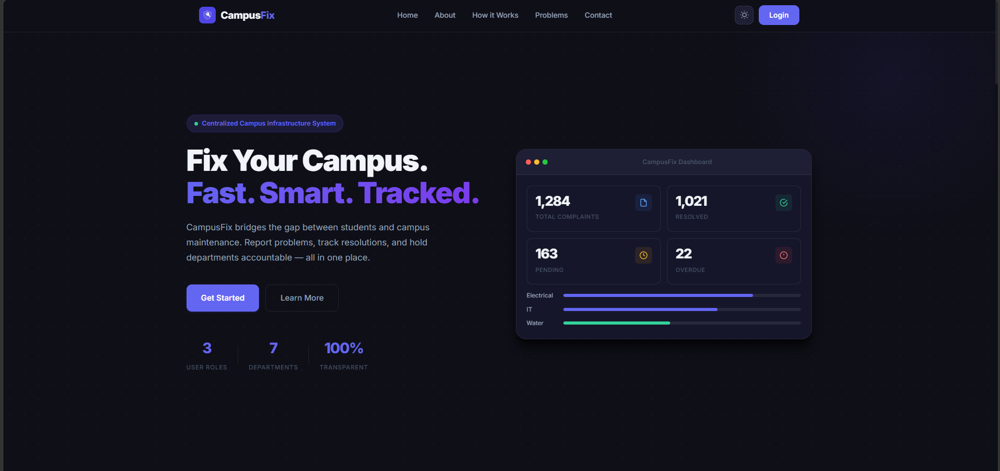
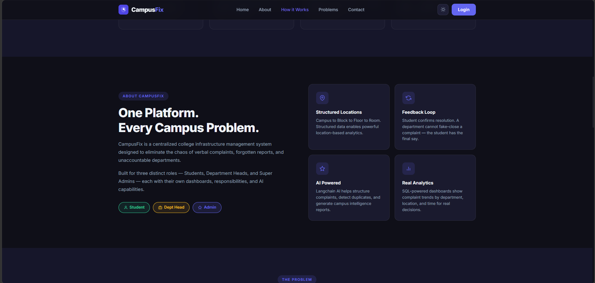
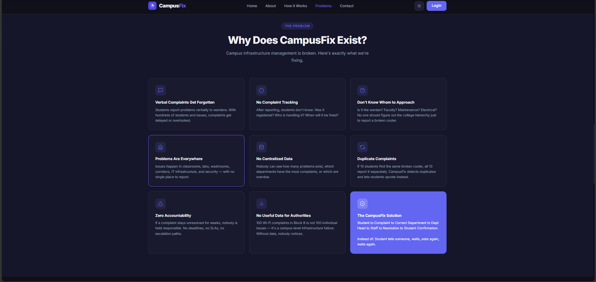
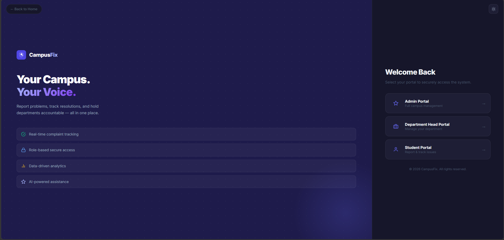
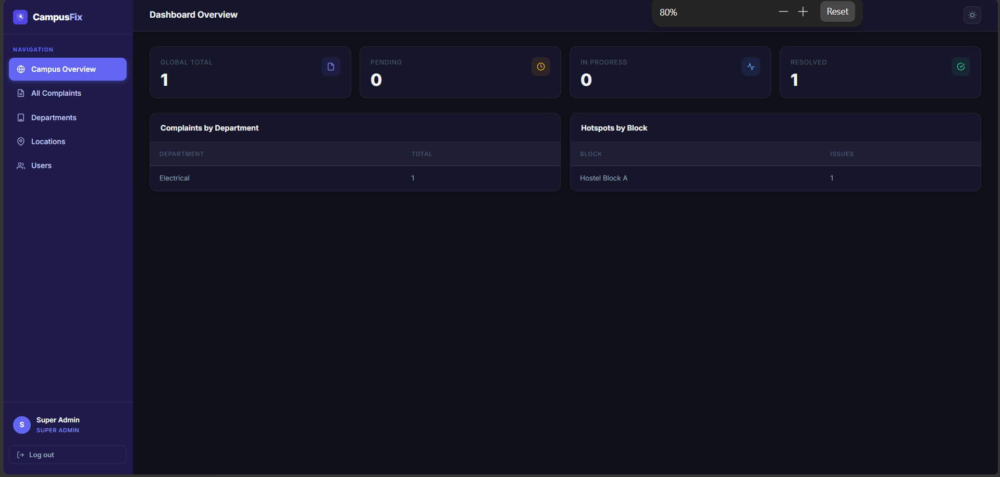
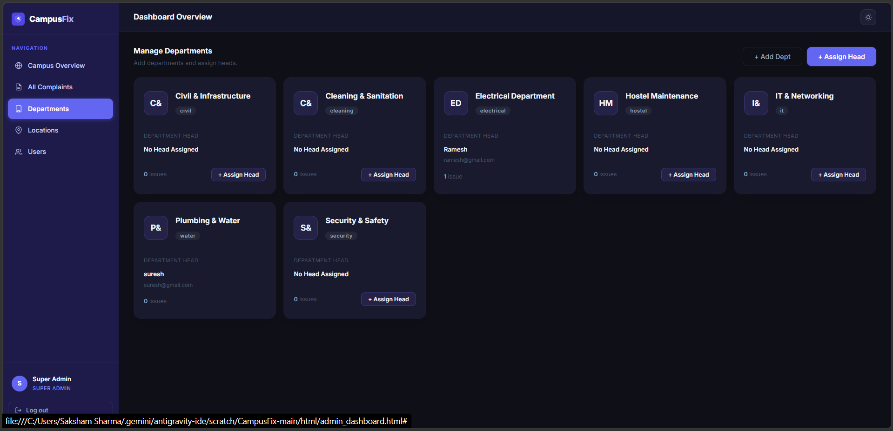
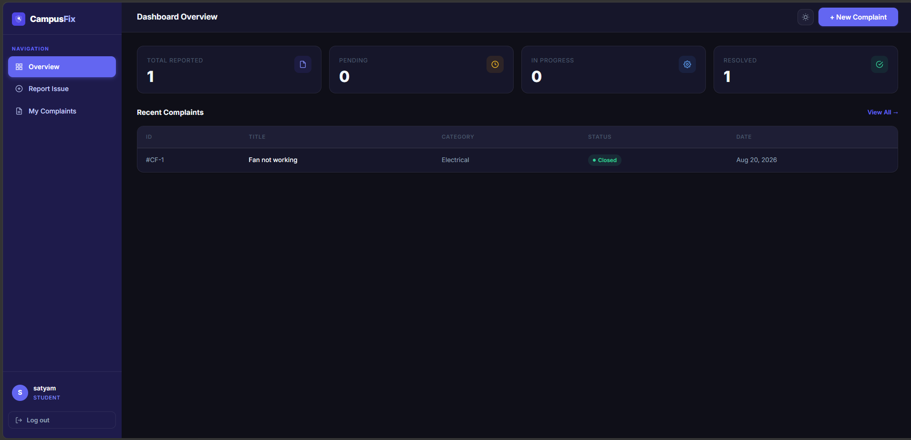
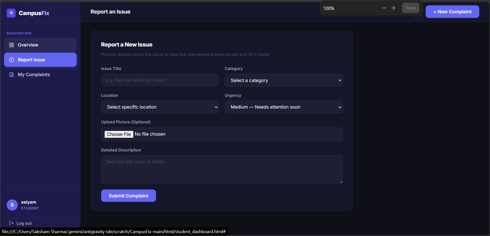
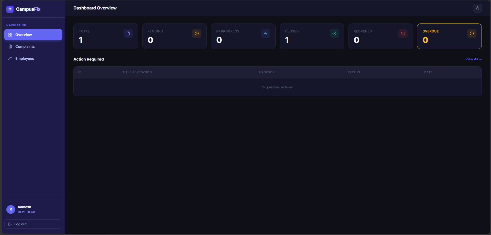
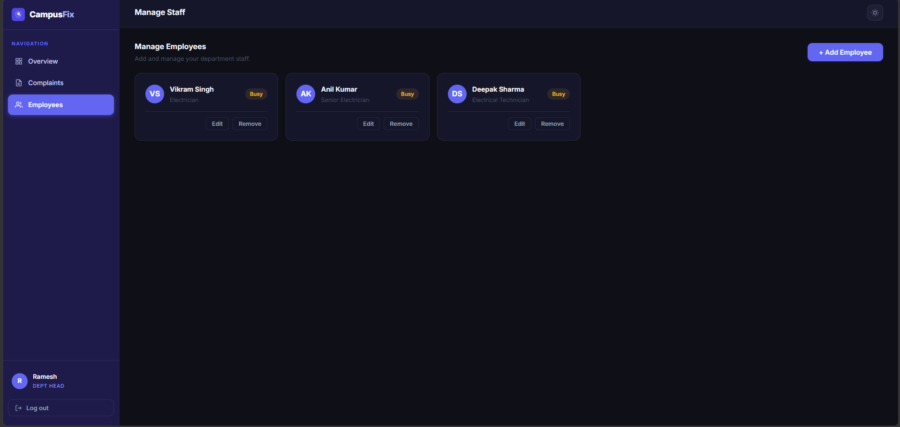

<div align="center">

   

# 🛡️ CampusFix
### *Fix Your Campus. Fast. Smart. Tracked.*

**A centralized college infrastructure complaint management system built with pure HTML, CSS, and JavaScript.**

</div>

---

## 📌 What is CampusFix?

CampusFix is a **full-stack web application** (frontend-only stack) designed to eliminate the chaos of verbal complaints and unaccountable departments in college campuses. Students can report infrastructure problems, department heads can manage and assign them to staff, and the super admin has a bird's-eye view of everything happening across the entire campus.

> Built entirely with **HTML, CSS, and Vanilla JavaScript** — no frameworks, no shortcuts. Data is managed via a **JSON Server** that acts as a lightweight REST API backend.

---

## 🚨 The Problem We Solve

| ❌ Before CampusFix | ✅ After CampusFix |
|---|---|
| Verbal complaints get forgotten | Every complaint is digitally logged with an ID |
| No tracking — students don't know what happened | Real-time status tracking (Pending → In Progress → Resolved) |
| Students don't know who to approach | Automatic routing to the correct department |
| 10 students report the same broken cooler separately | Smart duplicate detection with upvoting |
| Departments fake-close complaints | Student must confirm the fix — departments cannot cheat |
| Zero accountability or deadlines | Deadline tracking with overdue alerts |
| No data for authorities | Analytics dashboard — complaints by dept, block, and time |

---

## 👥 Three Role-Based Portals

### 👑 Super Admin
Full control of the campus system. Can add departments, assign department heads, manage all locations, view all complaints across every department, and activate/deactivate any user.

### 👨‍💼 Department Head
Receives complaints routed to their department. Can assign complaints to employees with a deadline, mark them as resolved, and manage their department's staff.

### 👨‍🎓 Student
Can register, log in, report issues with category, location, urgency and photo. Tracks all their submitted complaints. Can upvote existing duplicate issues. Confirms resolution when a fix is submitted by the department.

---

## ✨ Key Features

- 🔐 **Role-based Authentication** — 3 separate portals with secure session management
- 📋 **Smart Complaint Routing** — Complaints auto-routed to the correct department by category
- 🔁 **Duplicate Detection** — Same issue at same location? System detects it and lets students upvote instead
- ✅ **Student Resolution Confirmation** — Students must confirm a fix. Departments cannot fake-close
- ⏰ **Deadline & Overdue Tracking** — Heads assign deadlines; overdue complaints are flagged in red
- 📊 **Analytics Dashboard** — Complaints by department, hotspot blocks, and global stats
- 🌙 **Dark / Light Mode** — Full theme toggle across all pages
- 📱 **Responsive Design** — Works on all screen sizes

---

## 🗂️ Project Structure

```
CampusFix/
├── index.html                  # Landing page
├── css/
│   ├── style.css               # Global design system
│   └── auth.css                # Auth page styles
├── html/
│   ├── login.html              # Portal selection & login
│   ├── student_register.html   # Student registration
│   ├── student_dashboard.html  # Student portal
│   ├── dept_head_dashboard.html # Department Head portal
│   └── admin_dashboard.html   # Admin portal
├── js/
│   ├── auth.js                 # Login / session logic
│   ├── dashboard.js            # Shared dashboard utilities
│   ├── student.js              # Student dashboard logic
│   ├── dept_head.js            # Dept head dashboard logic
│   ├── admin.js                # Admin dashboard logic
│   └── validation.js           # Form validation helpers
├── database/
│   └── db.json                 # JSON Server database
└── Screenshot_of_site/         # UI screenshots
```

---

## 🚀 How to Run Locally

**Step 1 — Install JSON Server (one time)**
```bash
npm install -g json-server
```

**Step 2 — Start the backend**
```bash
cd CampusFix
npx json-server --watch database/db.json --port 3000
```

**Step 3 — Open the site**

Simply open `index.html` in your browser. The site is fully static — no build step needed.

---

## 🔑 Test Credentials

| Role | Email | Password |
|------|-------|----------|
| 👑 Super Admin | `admin@campusfix.com` | `admin@123` |
| 👨‍💼 Dept Head (Electrical) | `ramesh@gmail.com` | `password123` |
| 👨‍💼 Dept Head (Plumbing) | `suresh@gmail.com` | `password123` |
| 👨‍🎓 Student | Register a new account | — |

---

## 📸 Screenshots

### 🏠 Landing Page — Hero Section


---

### 📖 About Section — Platform Overview


---

### 🚨 Problem Section — Why CampusFix Exists


---

### 🔐 Login Page — Portal Selection


---

### 👑 Admin Dashboard — Campus Overview & Stats


---

### 🏢 Admin Dashboard — Manage Departments


---

### 👨‍🎓 Student Dashboard — My Complaints Overview


---

### 📝 Student Dashboard — Report an Issue Form


---

### 👨‍💼 Department Head Dashboard — Overview


---

### 👥 Department Head Dashboard — Manage Employees


---

## 🛠️ Tech Stack

| Technology | Purpose |
|------------|---------|
| **HTML5** | Structure and semantic markup |
| **CSS3** (Vanilla) | Styling, animations, dark/light theming |
| **JavaScript** (ES6+) | All business logic, API calls, DOM manipulation |
| **JSON Server** | Lightweight REST API — replaces a traditional backend |
| **Google Fonts (Inter)** | Typography |

> ⚠️ No frameworks. No libraries. No shortcuts. Pure HTML, CSS, and JS — as required.

---

## 📄 License

This project was built as part of a college web development assignment.

---

<div align="center">
  Made with ❤️ by the CampusFix Team
</div>
